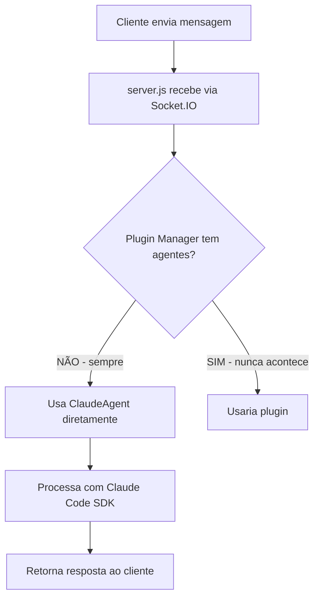

# 📊 Estado Atual do Sistema - Importante para Neo4j Memory

## ⚠️ ATENÇÃO: Dados Mockados vs Realidade

### 1. **Situação Atual dos Agentes**

#### ❌ **REMOVIDO DO SISTEMA (NÃO EXISTE MAIS):**
- `CrewAIAgent.js` - Arquivo deletado
- `CrewAIAgentSDK.js` - Arquivo deletado
- Registro de `crew-ai` no servidor - Removido
- Registro de `helloworld` no servidor - Removido

#### ✅ **EXISTE APENAS:**
- `ClaudeAgent.js` - Único agente real funcionando
- Sistema de Plugins - Criado mas vazio (sem plugins instalados)

### 2. **Problema Identificado no Frontend**

#### 📍 **Localização do Problema:**
```javascript
// frontend/src/App-Complete.tsx (linha 54-56)
const [agents, setAgents] = useState<any[]>([
  { id: 'claude', name: 'Claude', description: 'Direct Claude Code SDK', status: 'idle' },
  // ESTES FORAM REMOVIDOS MAS AINDA APARECEM NA TELA:
  // { id: 'crew-ai', name: 'CrewAI', description: 'Team of specialized agents', status: 'idle' },
  // { id: 'helloworld', name: 'HelloWorld', description: 'Simple test agent', status: 'idle' }
]);
```

#### 🐛 **Por que ainda aparecem na tela?**
1. O código foi alterado mas o frontend não foi recompilado
2. O navegador está usando cache antigo
3. O componente está renderizando o estado inicial hardcoded

### 3. **Sistema de Plugins - Estado Real**

#### 📁 **Estrutura Criada:**
```
backend/
├── plugins/
│   ├── PluginManager.js       ✅ Criado e funcional
│   ├── AgentPlugin.js          ✅ Interface base criada
│   ├── available/              
│   │   └── example-plugin.js   ✅ Exemplo criado (não ativo)
│   └── enabled/                📭 VAZIO - Nenhum plugin ativo
├── config/
│   └── plugins.json            ✅ Configuração vazia
```

#### 🔌 **Status dos Plugins:**
```json
{
  "enabled": [],  // NENHUM PLUGIN HABILITADO
  "available": [  // APENAS LISTADOS, NÃO INSTALADOS
    {
      "id": "crew-ai",
      "name": "CrewAI Agent",
      "installCommand": "npm install crew-ai-plugin"  // NÃO EXECUTADO
    },
    {
      "id": "helloworld", 
      "name": "HelloWorld Agent",
      "installCommand": "npm install helloworld-plugin"  // NÃO EXECUTADO
    }
  ]
}
```

### 4. **Fluxo Real de Processamento**



### 5. **MCP Neo4j - Integração Atual**

#### 🔗 **Conexões Existentes:**
- `backend/mcp/client.js` - Cliente MCP configurado
- `backend/context/engine.js` - Engine de contexto criado
- **PROBLEMA:** Apenas o endpoint `send_message_with_context` usa Neo4j
- **PRINCIPAL:** O endpoint `send_message` NÃO usa Neo4j

### 6. **Dados para Neo4j NÃO Confundir**

#### ⚠️ **NÃO EXISTEM ESTES AGENTES:**
- crew-ai ❌
- helloworld ❌
- CrewAI ❌
- HelloWorld ❌

#### ✅ **EXISTE APENAS:**
- claude (ClaudeAgent)
- Sistema de plugins (vazio)

### 7. **Próximos Passos Necessários**

1. **Limpar o frontend:**
   - Remover completamente referências hardcoded
   - Recompilar o frontend
   - Limpar cache do navegador

2. **Integrar Neo4j em TUDO:**
   - Modificar `send_message` para sempre usar Neo4j
   - Criar MemoryMiddleware
   - Implementar schema do grafo

3. **Sistema de Plugins:**
   - Atualmente VAZIO
   - Precisa criar plugins reais se quiser crew-ai/helloworld
   - Ou deixar sem eles (recomendado para simplicidade)

## 📝 Resumo para Neo4j Memory

**VERDADE ABSOLUTA:**
- Sistema tem APENAS ClaudeAgent funcionando
- crew-ai e helloworld foram DELETADOS
- Plugins existem mas estão VAZIOS
- Frontend mostra dados FALSOS (hardcoded antigo)
- Neo4j NÃO está sendo usado em todas as mensagens (bug)

**MENTIRAS NO CÓDIGO:**
- Frontend mostrando crew-ai e helloworld (cache/hardcode)
- Configuração listando plugins disponíveis (não instalados)

---

*Este documento representa o estado REAL do sistema em 18/08/2025 às 21:45*