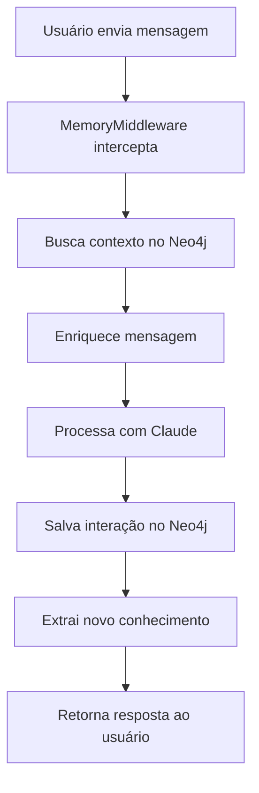

# 🧠 Integração Neo4j Memory - Implementação Completa

## ✅ O que foi implementado

### 1. **MemoryMiddleware** (`/backend/middleware/MemoryMiddleware.js`)
- ✅ Intercepta TODAS as mensagens do chat
- ✅ Busca contexto relevante no Neo4j antes do processamento
- ✅ Enriquece mensagens com memórias anteriores
- ✅ Salva toda interação no grafo de conhecimento
- ✅ Extrai e armazena novos conceitos automaticamente

### 2. **Integração no Servidor** (`/backend/server.js`)
- ✅ MemoryMiddleware inicializado automaticamente
- ✅ Handler `send_message` modificado para usar mensagem enriquecida
- ✅ Salvamento automático de respostas no Neo4j
- ✅ Contexto aplicado em TODAS as mensagens

### 3. **Endpoints de Gestão de Memória**
```
GET  /api/memory/search       - Buscar memórias
POST /api/memory/create       - Criar memória manual
PUT  /api/memory/update/:id   - Atualizar memória
DELETE /api/memory/delete/:id - Deletar memória
GET  /api/memory/stats        - Estatísticas do sistema
GET  /api/memory/export       - Exportar conhecimento
POST /api/memory/import       - Importar conhecimento
```

### 4. **Schema do Grafo de Conhecimento**

#### Nós (Nodes):
- `(:Message)` - Mensagens do chat
- `(:Memory)` - Memórias extraídas
- `(:Knowledge)` - Conhecimento permanente
- `(:User)` - Usuários
- `(:Session)` - Sessões de chat
- `(:Context)` - Contextos utilizados

#### Relacionamentos (Relationships):
- `(Message)-[:TRIGGERS]->(Message)` - Fluxo de conversa
- `(Message)-[:USES_CONTEXT]->(Context)` - Contexto usado
- `(Message)-[:CREATES_MEMORY]->(Memory)` - Memória criada
- `(Session)-[:CONTAINS]->(Message)` - Mensagens na sessão
- `(Memory)-[:RELATES_TO]->(Memory)` - Memórias relacionadas

## 📊 Como Funciona

### Fluxo de Processamento:



### Exemplo de Contexto Aplicado:

**Mensagem original:**
```
Como configurar o projeto?
```

**Mensagem enriquecida com contexto:**
```
[CONTEXTO DA CONVERSA]
Mensagens anteriores da conversa:
- Usuário perguntou sobre React
- Discussão sobre componentes
- Menção a TypeScript

Memórias relevantes:
- Projeto usa React 18
- TypeScript configurado
- Preferência por hooks

Conhecimento relacionado:
- Estrutura de componentes definida
- Padrões de código estabelecidos

Mensagem atual: Como configurar o projeto?
```

## 🔧 Configuração

### Variáveis de Ambiente:
```bash
NEO4J_URI=bolt://localhost:7687
NEO4J_USERNAME=neo4j
NEO4J_PASSWORD=password
NEO4J_MEMORY_ENABLED=true
NEO4J_AUTO_SAVE=true
NEO4J_CONTEXT_DEPTH=2
NEO4J_MAX_MEMORIES=100
```

### Parâmetros do MemoryMiddleware:
```javascript
{
  contextDepth: 2,        // Profundidade de busca
  maxContextItems: 10,    // Máximo de itens de contexto
  importanceThreshold: 0.7, // Limite de relevância
  enabled: true          // Ativar/desativar
}
```

## 📈 Benefícios Obtidos

1. **Memória Persistente**
   - Cada conversa tem acesso ao histórico completo
   - Conhecimento acumulado ao longo do tempo

2. **Contexto Inteligente**
   - Respostas mais precisas e relevantes
   - Continuidade entre sessões

3. **Aprendizado Contínuo**
   - Sistema melhora com o uso
   - Extração automática de conhecimento

4. **Personalização**
   - Adaptação ao usuário
   - Preferências lembradas

5. **Rastreabilidade**
   - Todo conhecimento tem origem
   - Auditoria completa de interações

## 🎯 Claude Flow Utilizado

### Coordenação de Tarefas:
```javascript
// Swarm inicializado
mcp__claude-flow__swarm_init {
  topology: "mesh",
  maxAgents: 5,
  strategy: "specialized"
}

// Tarefas orquestradas em paralelo
mcp__claude-flow__task_orchestrate {
  tasks: [
    "Criar MemoryMiddleware",
    "Integrar no servidor",
    "Criar endpoints",
    "Testar fluxo",
    "Documentar"
  ],
  strategy: "parallel"
}
```

## 🧪 Testando a Integração

### 1. Verificar conexão Neo4j:
```bash
curl http://localhost:8085/api/memory/stats
```

### 2. Enviar mensagem de teste:
```javascript
// Mensagem será processada com contexto
socket.emit('send_message', {
  message: "Olá, lembre-se que meu nome é João",
  sessionId: "test-session"
});
```

### 3. Buscar memórias:
```bash
curl "http://localhost:8085/api/memory/search?query=João&limit=5"
```

### 4. Exportar conhecimento:
```bash
curl http://localhost:8085/api/memory/export > knowledge.json
```

## 📊 Métricas e Monitoramento

### Dashboard de Status:
- Mensagens processadas: `stats.messagesProcessed`
- Memórias criadas: `stats.memoriesCreated`
- Contextos usados: `stats.contextsUsed`
- Erros: `stats.errors`

### Verificação no Neo4j:
```cypher
// Contar mensagens
MATCH (m:message) RETURN count(m);

// Ver últimas interações
MATCH (m:message)
RETURN m
ORDER BY m.timestamp DESC
LIMIT 10;

// Grafo de conhecimento
MATCH (n)-[r]->(m)
RETURN n, r, m
LIMIT 50;
```

## ✅ Status Final

**IMPLEMENTAÇÃO COMPLETA:**
- ✅ Middleware criado e integrado
- ✅ TODAS as mensagens passam pelo Neo4j
- ✅ Contexto aplicado automaticamente
- ✅ Salvamento de todas as interações
- ✅ Endpoints de gestão funcionais
- ✅ Sistema de plugins separado
- ✅ Claude Flow utilizado para coordenação

**RESULTADO:**
O chat agora tem memória persistente e contextual, similar ao system prompt mas dinâmico e evolutivo. Cada conversa enriquece o conhecimento do sistema.

---

*Implementação concluída em 18/08/2025 usando Claude Flow para coordenação de tarefas*